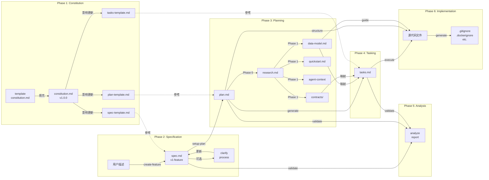
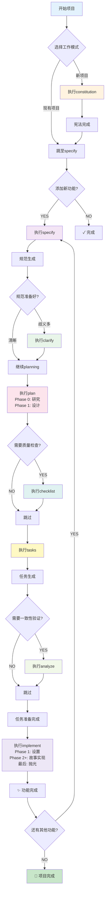
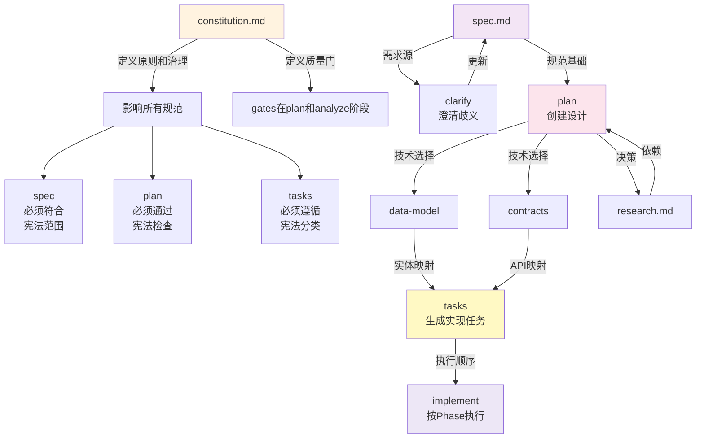

# Spec-Kit 工作流程完整文档

## 概述

Spec-Kit 是一个结构化的项目开发工作流程，它通过一系列顺序的命令来引导项目从需求定义、规范制定、规划、任务分解到最后的实现。该工作流程强制执行一套项目治理原则（Constitution），确保整个开发过程的一致性和质量。

## 核心工作流程阶段

### 阶段1: 项目宪法建立 (`/speckit.constitution`)

**职责**: 创建或更新项目治理宪法  
**输入**: 用户提供的项目原则和治理规则  
**输出**: `.specify/memory/constitution.md`

**主要步骤**:
1. 加载现有宪法模板 (包含占位符如 `[PROJECT_NAME]`, `[PRINCIPLE_1_NAME]` 等)
2. 从用户输入或现有仓库上下文中收集具体值
3. 验证版本号递增 (MAJOR.MINOR.PATCH 语义化版本)
4. 填充所有占位符，确保没有遗留的未定义标记
5. 检查一致性: 验证所有依赖的模板文件(plan-template, spec-template, tasks-template等)是否与新宪法对齐
6. 生成同步影响报告 (HTML注释形式)
7. 更新宪法文件并输出最终摘要

**关键产物**:
- `.specify/memory/constitution.md` - 项目治理文件 (MAJOR.MINOR.PATCH 版本)
- 版本变更说明和模板更新清单

**文件更新关系**:
```
constitution.md 
    ↓ 影响
├── plan-template.md (需验证宪法检查部分)
├── spec-template.md (需验证范围/需求对齐)
├── tasks-template.md (需验证任务分类反映新原则)
└── 所有command文件 (需验证是否有过时参考)
```

---

### 阶段2: 功能规范制定 (`/speckit.specify`)

**职责**: 根据自然语言特性描述创建或更新功能规范  
**输入**: 用户的功能描述 (作为 `/speckit.specify` 后的参数)  
**输出**: `specs/[###-feature-name]/spec.md`

**主要步骤**:
1. 从特性描述生成简洁的短名称 (2-4个单词的分支名称，如 "user-auth", "oauth2-api-integration")
2. 检查现有分支避免重复:
   - 执行 `git fetch --all --prune` 获取最新远程分支
   - 从远程分支、本地分支、规范目录中查找最高编号
   - 计算下一个可用编号
3. 运行创建特性脚本: `.specify/scripts/powershell/create-new-feature.ps1 -Json`
4. 加载规范模板 `.specify/templates/spec-template.md`
5. 填充规范内容:
   - 提取关键概念 (角色、行动、数据、约束)
   - 编写用户场景和测试 (按优先级P1/P2/P3排序，每个必须独立可测试)
   - 生成功能需求 (每个需求必须可测试)
   - 定义成功标准 (量化指标+定性指标)
   - 识别关键实体 (如涉及数据)
6. 标记歧义处理 (最多3个 `[NEEDS CLARIFICATION]` 标记)
7. 写入规范文件

**关键产物**:
- `specs/[###-feature-name]/spec.md` - 功能规范
- Git branch: `[###-feature-name]` (创建但可能在后续步骤推送)

**文件更新关系**:
```
ARGUMENTS (用户输入)
    ↓
create-new-feature.ps1 (创建分支和目录结构)
    ↓
spec.md (创建)
    ↓ 作为输入给下一阶段
```

**移交选项**:
- 构建规范 → `/speckit.plan` (推荐)
- 澄清需求 → `/speckit.clarify` (如有歧义)

---

### 阶段3: 需求澄清 (可选) (`/speckit.clarify`)

**职责**: 识别规范中的歧义并通过目标明确的问题进行澄清  
**输入**: 完整的功能规范 (来自 `/speckit.specify`)  
**输出**: 更新后的 `specs/[###-feature-name]/spec.md` (添加澄清答案)

**主要步骤**:
1. 运行先决条件检查: `.specify/scripts/powershell/check-prerequisites.ps1 -Json -PathsOnly`
2. 加载当前规范文件
3. 执行结构化歧义扫描 (使用分类法):
   - 功能范围和行为
   - 域名和数据模型
   - 交互和用户体验流程
   - 非功能属性 (性能、可扩展性、可靠性、可观测性、安全性等)
   - 集成和外部依赖
   - 边界情况和失败处理
   - 约束和权衡
   - 术语和一致性
   - 完成信号
   - 杂项/占位符
4. 生成最多5个优先级明确的澄清问题
5. 交互式提问循环:
   - 每次提出一个问题
   - 接受用户答案
   - 必要时进行后续跟进
6. 将澄清答案编码回规范文件

**关键产物**:
- 更新的 `specs/[###-feature-name]/spec.md` (包含澄清答案)

**决策树**:
```
规范中有歧义?
├─ YES → 运行澄清
│   ├─ 澄清后 → 进入规划阶段
│   └─ 跳过澄清 → 警告 (增加下游返工风险)
└─ NO → 直接进入规划阶段
```

---

### 阶段4: 技术规划 (`/speckit.plan`)

**职责**: 执行实现规划工作流程，生成设计文件  
**输入**: 功能规范 + 宪法 + 规划模板  
**输出**: `specs/[###-feature-name]/` 下的多个设计文件

**主要步骤**:

#### 4.1 设置
1. 运行 `.specify/scripts/powershell/setup-plan.ps1 -Json`
2. 解析JSON获取: FEATURE_SPEC, IMPL_PLAN, SPECS_DIR, BRANCH 路径

#### 4.2 加载上下文
- 读取功能规范
- 读取 `.specify/memory/constitution.md`
- 加载规划模板

#### 4.3 Phase 0: 研究与澄清
**目标**: 解决所有技术不确定性

**任务**:
1. 从技术背景中提取未知项:
   - 每个 `NEEDS CLARIFICATION` → 研究任务
   - 每个依赖 → 最佳实践任务
   - 每个集成 → 模式任务
2. 生成和分派研究代理
3. 编制发现到 `research.md`:
   - 决策: [选择了什么]
   - 原理: [为什么选择]
   - 考虑的备选方案: [还评估了什么]

**输出**: `specs/[###-feature-name]/research.md`

#### 4.4 Phase 1: 设计与合约
**前置条件**: `research.md` 完成

**任务**:
1. 从功能规范提取实体 → `data-model.md`:
   - 实体名称、字段、关系
   - 验证规则
   - 状态转换 (如适用)

2. 从功能需求生成API合约:
   - 每个用户操作 → 端点
   - 使用标准REST/GraphQL模式
   - 输出OpenAPI/GraphQL schema到 `/contracts/`

3. 更新代理上下文:
   - 运行 `.specify/scripts/powershell/update-agent-context.ps1 -AgentType claude`
   - 只添加当前规划中的新技术
   - 保留标记之间的手动修改

4. 创建快速启动指南 `quickstart.md`:
   - 测试场景
   - 集成示例

**输出**:
- `specs/[###-feature-name]/data-model.md`
- `specs/[###-feature-name]/contracts/` (API规范)
- `specs/[###-feature-name]/quickstart.md`
- 更新的代理特定文件

#### 4.5 Constitution 检查
- 初始检查 (Phase 0之前)
- 最终检查 (Phase 1设计之后)
- 不符合则报告错误

**关键产物**:
- `specs/[###-feature-name]/research.md` (Phase 0)
- `specs/[###-feature-name]/data-model.md` (Phase 1)
- `specs/[###-feature-name]/contracts/` (Phase 1)
- `specs/[###-feature-name]/quickstart.md` (Phase 1)

**文件更新关系**:
```
spec.md + constitution.md
    ↓
plan.md (创建并填充)
    ↓
Phase 0: research.md (生成)
    ↓
Phase 1: data-model.md, contracts/, quickstart.md (生成)
    ↓ 并更新
update-agent-context.ps1
```

**移交选项**:
- 创建任务 → `/speckit.tasks` (推荐)
- 创建检查清单 → `/speckit.checklist` (可选)

---

### 阶段5: 任务分解 (`/speckit.tasks`)

**职责**: 生成可执行的、依赖排序的任务清单  
**输入**: 规划文件 (plan.md + 可选的data-model.md, contracts/, research.md, quickstart.md)  
**输出**: `specs/[###-feature-name]/tasks.md`

**主要步骤**:
1. 运行先决条件检查: `.specify/scripts/powershell/check-prerequisites.ps1 -Json`
2. 从FEATURE_DIR加载设计文档:
   - **必需**: plan.md, spec.md
   - **可选**: data-model.md, contracts/, research.md, quickstart.md
3. 执行任务生成工作流:
   - 从plan.md提取技术栈和项目结构
   - 从spec.md提取用户故事和优先级
   - 映射实体到用户故事 (如有data-model.md)
   - 映射端点到用户故事 (如有contracts/)
   - 提取技术决策 (如有research.md)
   - 按优先级生成任务 (P1, P2, P3等)
4. 生成tasks.md:
   - Phase 1: 设置任务 (项目初始化)
   - Phase 2: 基础任务 (所有用户故事的阻挡前置条件)
   - Phase 3+: 按用户故事优先级的阶段 (每个阶段一个故事)
   - 最后: 抛光和交叉关注
5. 任务格式验证 (使用严格的checklistformat):
   - `- [ ] [TaskID] [P?] [Story?] Description with file path`
   - TaskID: T001, T002, T003... (执行顺序)
   - [P] 标记: 可并行化任务才包含
   - [Story] 标记: 仅用户故事阶段任务包含 (如[US1], [US2])
   - 清晰的文件路径
6. 输出依赖图、并行执行示例、MVP范围建议

**关键产物**:
- `specs/[###-feature-name]/tasks.md` (完整任务清单)
- 依赖关系图
- 并行执行机会识别

**任务格式示例**:
```
- [ ] T001 Create project structure per implementation plan
- [ ] T005 [P] Implement authentication middleware in src/middleware/auth.py
- [ ] T012 [P] [US1] Create User model in src/models/user.py
- [ ] T014 [US1] Implement UserService in src/services/user_service.py
```

**移交选项**:
- 一致性分析 → `/speckit.analyze` (推荐)
- 实现 → `/speckit.implement` (跳过分析)

---

### 阶段6: 一致性分析 (可选) (`/speckit.analyze`)

**职责**: 跨spec.md、plan.md、tasks.md进行非破坏性的一致性和质量分析  
**输入**: 功能规范、规划和任务  
**输出**: 分析报告 (无文件修改)

**主要步骤**:
1. 运行先决条件检查获取文件路径
2. 加载所需文件:
   - 规范: 概述、功能需求、非功能需求、用户故事、边界情况
   - 规划: 架构、堆栈选择、数据模型、阶段、约束
   - 任务: 任务ID、描述、阶段、并行标记、文件路径
   - 宪法: 原则名称和MUST/SHOULD声明
3. 构建语义模型:
   - 需求清单 (功能+非功能)
   - 用户故事/行动清单
   - 任务覆盖映射
   - 宪法规则集
4. 检测通过 (限制50个发现):
   - **重复检测**: 识别接近重复的需求
   - **歧义检测**: 标记模糊形容词(快速、可扩展、安全、直观、健壮)
   - **规范不足检测**: 缺少对象或可测量结果的需求
   - **宪法对齐**: 检查与MUST原则的冲突
   - **覆盖完整性**: 需求到任务的映射完整性
5. 输出结构化分析报告 (按优先级)
6. 提供修正建议 (用户需显式批准)

**关键产物**:
- 分析报告 (一致性问题、歧义、规范不足)
- 修正建议清单

**检测规则**:
```
重复 → 合并低质量表述
歧义 → 要求量化标准
规范不足 → 标记缺失需求
宪法冲突 → 标记为CRITICAL
```

**注意**: 此命令仅报告，不修改任何文件。修正需要显式的后续操作。

---

### 阶段7: 需求质量检查清单 (可选) (`/speckit.checklist`)

**职责**: 为当前功能生成自定义检查清单，验证需求的质量  
**输入**: 功能规范和用户焦点选择  
**输出**: `specs/[###-feature-name]/checklists/[domain].md`

**核心概念**: **需求英文单元测试** - 验证需求本身的质量，而不是实现。

**关键步骤**:
1. 运行先决条件检查
2. 动态澄清意图 (最多3个问题):
   - 从用户短语和规范中提取信号
   - 集群到候选焦点区域 (最多4个)
   - 仅询问实质上改变清单内容的信息
3. 理解用户请求:
   - 结合 $ARGUMENTS 和澄清答案
   - 推导清单主题 (安全性、审查、部署、用户体验等)
   - 整合必须检查的项目
4. 加载特性上下文: spec.md, plan.md (如存在), tasks.md (如存在)
5. 生成清单:
   - 创建 `specs/[###-feature-name]/checklists/` 目录
   - 按域生成唯一文件名 (如 ux.md, api.md, security.md)
   - 按需求质量维度分组:
     - 需求完整性
     - 需求清晰性
     - 需求一致性
     - 验收标准质量
     - 场景覆盖
     - 边界情况覆盖
     - 非功能需求
     - 依赖和假设
     - 歧义和冲突
   - 每项遵循格式: 问题 + 质量维度 [Completeness/Clarity/etc.] + 规范引用 [Spec §X.Y]
6. 可追溯性验证 (≥80% 的项必须包含追溯参考)
7. 内容整合 (候选项>40时按风险/影响优先)

**禁止项** (实现测试，不是需求测试):
- ❌ "验证按钮点击正确"
- ❌ "测试悬停状态有效"
- ❌ "确认API返回200"

**必需项** (测试需求质量):
- ✅ "所有卡片类型都定义了视觉层次要求吗？" [完整性]
- ✅ "是否用具体的大小/定位量化了'突出显示'？" [清晰性]
- ✅ "所有交互元素的悬停状态要求是否一致？" [一致性]

**关键产物**:
- `specs/[###-feature-name]/checklists/[domain].md`

---

### 阶段8: 实现执行 (`/speckit.implement`)

**职责**: 执行规划的实现，处理tasks.md中定义的所有任务  
**输入**: 完整的任务清单 (tasks.md) + 规划文件  
**输出**: 实现的功能代码 + 可选的ignore文件

**主要步骤**:

#### 8.1 先决条件验证
1. 运行 `.specify/scripts/powershell/check-prerequisites.ps1 -Json -RequireTasks -IncludeTasks`
2. 检查检查清单状态 (如存在checklists/目录):
   - 扫描所有检查清单文件
   - 计算总项、完成项、未完成项
   - 创建状态表:
     ```
     | Checklist | Total | Completed | Incomplete | Status |
     |-----------|-------|-----------|------------|--------|
     | ux.md     | 12    | 12        | 0          | ✓ PASS |
     | test.md   | 8     | 5         | 3          | ✗ FAIL |
     ```
   - 如果任何清单不完整:
     - 显示表格并询问用户是否继续 (是/否)
     - 如果用户说"否"则停止
     - 如果用户说"是"则继续

#### 8.2 项目设置验证
1. 加载和分析实现上下文:
   - **必需**: 读取tasks.md (完整任务列表), plan.md (技术栈)
   - **可选**: data-model.md, contracts/, research.md, quickstart.md
2. 创建/验证ignore文件 (基于技术栈):
   - 检查是否是git仓库 → 创建/验证 .gitignore
   - 检查Dockerfile → 创建/验证 .dockerignore
   - 检查eslintrc → 创建/验证 .eslintignore
   - 按技术栈添加模式 (Node.js, Python, Java, Go, Rust, C++等)
   - 按工具添加模式 (Docker, ESLint, Prettier, Terraform等)

#### 8.3 任务执行
1. 解析tasks.md结构和提取:
   - 按优先级和阶段分组任务
   - 识别依赖关系
   - 计算并行执行机会
2. 按照Phase顺序执行任务:
   - Phase 1 (设置) → Phase 2 (基础) → Phase 3+ (故事) → 最后 (抛光)
3. 对于每个任务:
   - 标记为进行中
   - 执行任务 (调用代理或执行代码)
   - 验证输出
   - 标记为完成

**关键产物**:
- 实现的代码文件 (根据plan.md定义的结构)
- 创建/更新的ignore文件 (.gitignore, .dockerignore等)
- 进度报告 (完成任务数/总任务数)

**Ignore文件模式示例**:
- Node.js/JavaScript: `node_modules/`, `dist/`, `build/`, `*.log`, `.env*`
- Python: `__pycache__/`, `*.pyc`, `.venv/`, `venv/`, `dist/`
- Java: `target/`, `*.class`, `*.jar`, `.gradle/`, `build/`
- C#/.NET: `bin/`, `obj/`, `*.user`, `*.suo`, `packages/`
- Rust: `target/`, `debug/`, `release/`, `*.prof*`, `.env*`

---

## 工作流程关键要素

### 文件结构

```
.specify/                          # 规范工具配置
├── memory/
│   └── constitution.md            # 项目治理宪法
├── scripts/
│   └── powershell/
│       ├── create-new-feature.ps1
│       ├── setup-plan.ps1
│       ├── check-prerequisites.ps1
│       ├── update-agent-context.ps1
│       └── ...
└── templates/
    ├── spec-template.md
    ├── plan-template.md
    ├── tasks-template.md
    ├── checklist-template.md
    └── ...

specs/[###-feature-name]/          # 每个特性的规范
├── spec.md                        # 功能规范
├── plan.md                        # 实现规划
├── research.md                    # Phase 0 研究 (可选)
├── data-model.md                  # Phase 1 数据模型
├── quickstart.md                  # Phase 1 快速启动
├── contracts/                     # Phase 1 API合约
├── tasks.md                       # Phase 2 任务清单
└── checklists/                    # 可选检查清单
    ├── ux.md
    ├── api.md
    ├── security.md
    └── ...
```

### 移交和继续规则

每个命令输出包含 **移交** 选项，指示建议的后续步骤：

```
handoffs:
  - label: 下一步标签
    agent: 目标命令名称
    prompt: 提示用户的问题或上下文
    send: true (如果应自动继续)
```

### 决策点和条件执行

整个工作流程包含多个决策点：

| 决策点 | 条件 | 路径 |
|--------|------|------|
| 澄清需要? | spec中有歧义 | 执行clarify → plan |
| 澄清跳过? | spec足够清晰 | 直接plan |
| 分析? | plan完成后 | 执行analyze (可选) |
| 检查清单? | 需求质量验证 | 执行checklist (可选) |
| 实现? | tasks完成后 | 执行implement |
| 检查清单完成? | checklist未完成 | 询问用户继续? |

---

## Mermaid 流程图

### 主要工作流程

```mermaid
graph TD
    A["开始: 项目初始化"] --> B["📋 /speckit.constitution<br/>创建项目治理宪法"]
    B --> B1["定义项目原则<br/>验证版本递增<br/>检查模板一致性"]
    B1 --> C{"需要规范<br/>新功能?"}
    C -->|YES| D["✨ /speckit.specify<br/>创建功能规范"]
    C -->|NO| E["✓ 宪法完成"]
    
    D --> D1["分析特性描述<br/>创建分支和目录<br/>生成规范文件"]
    D1 --> F{"规范中有<br/>歧义?"}
    
    F -->|YES| G["❓ /speckit.clarify<br/>澄清需求歧义"]
    G --> G1["扫描歧义<br/>提出目标问题<br/>编码答案"]
    G1 --> H["规范澄清完成"]
    F -->|NO| H["规范准备好了"]
    
    H --> I["📐 /speckit.plan<br/>执行技术规划"]
    I --> I1["Phase 0: 研究技术选择"]
    I1 --> I2["Phase 1: 设计数据模型<br/>生成API合约<br/>更新代理上下文"]
    I2 --> I3["验证宪法检查"]
    I3 --> J["规划完成"]
    
    J --> K{"需要验证<br/>需求质量?"}
    K -->|YES| L["✅ /speckit.checklist<br/>生成质量清单"]
    K -->|NO| M["跳过检查清单"]
    L --> L1["测试需求完整性<br/>测试需求清晰性<br/>测试需求一致性"]
    L1 --> M
    
    M --> N["🎯 /speckit.tasks<br/>分解为任务"]
    N --> N1["提取用户故事<br/>映射到实体和端点<br/>生成依赖排序的任务"]
    N1 --> O{"需要一致性<br/>分析?"}
    
    O -->|YES| P["🔍 /speckit.analyze<br/>交叉工件分析"]
    P --> P1["检测重复<br/>检测歧义<br/>检测规范不足<br/>检测宪法冲突"]
    P1 --> Q["分析报告完成"]
    O -->|NO| Q
    
    Q --> R["⚙️ /speckit.implement<br/>执行实现"]
    R --> R1["验证检查清单状态"]
    R1 --> R2["创建ignore文件"]
    R2 --> R3["按Phase执行任务"]
    R3 --> S["✨ 实现完成"]
    
    S --> T["🎉 项目准备完成"]
    
    style A fill:#e1f5ff
    style B fill:#fff3e0
    style D fill:#f3e5f5
    style G fill:#e8f5e9
    style I fill:#fce4ec
    style L fill:#e0f2f1
    style N fill:#fff9c4
    style P fill:#f1f8e9
    style R fill:#ede7f6
    style T fill:#c8e6c9
```



### 详细文件流



### 决策流



### 配置依赖



---

## 关键概念总结

### 约束和规则

| 概念 | 规则 |
|------|------|
| **Constitution版本** | 语义化 (MAJOR.MINOR.PATCH) |
| **分支编号** | 全局递增整数 ([###-feature-name]) |
| **任务ID格式** | T001, T002, T003... (执行顺序) |
| **优先级** | P1 (P1 ≥ P2 ≥ P3 ...) |
| **澄清问题** | 最多5个，仅处理实质影响 |
| **检查清单项** | 测试需求质量，不测试实现 |
| **任务标记** | [P] (并行), [Story] (用户故事) |
| **文件路径** | 绝对路径，避免歧义 |

### 输入输出映射

| 阶段 | 输入 | 命令 | 输出 |
|------|------|------|------|
| 治理 | 原则描述 | constitution | constitution.md v.X.Y.Z |
| 需求 | 特性描述 | specify | spec.md + 分支 |
| 澄清 | 规范文件 | clarify | 更新的spec.md |
| 规划 | 规范+宪法 | plan | research.md, data-model.md, contracts/, quickstart.md |
| 质量 | 规范+规划 | checklist | checklists/[domain].md |
| 任务 | 规划+设计 | tasks | tasks.md |
| 验证 | spec+plan+tasks | analyze | 分析报告 |
| 实现 | 任务+规划 | implement | 源代码+ignore文件 |

### 工作流程特点

1. **线性但灵活**: 基本顺序固定，但支持可选步骤 (clarify, checklist, analyze)
2. **递归结构**: 宪法影响所有阶段；可为每个新功能重复工作流
3. **文档驱动**: 每个阶段生成文档作为下一阶段输入
4. **质量门**: 宪法检查、一致性分析、检查清单完成度
5. **决策记录**: research.md、checklist.md 记录所有决策
6. **可追踪性**: 从spec → tasks → implement 的完整映射
7. **并行友好**: 任务标记 [P] 允许多个任务并行执行

---

## 使用建议

- **新项目**: 必须从constitution开始，建立项目治理基础
- **最小工作流**: constitution → specify → plan → tasks → implement
- **质量导向**: 添加clarify和checklist步骤以提高规范质量
- **风险管理**: 使用analyze步骤在实现前捕获不一致
- **迭代开发**: 对每个新功能重复specify到implement的周期
- **版本管理**: 在constitution版本变化时更新所有依赖模板

